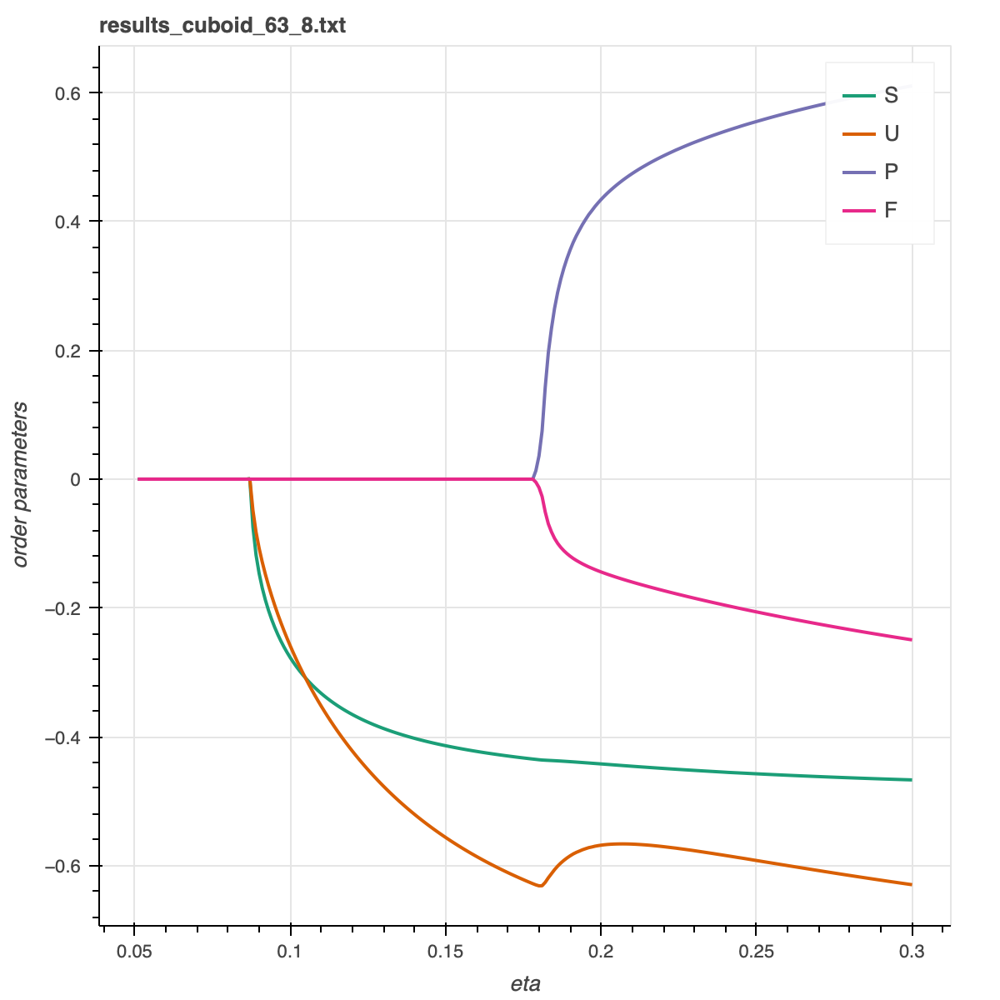

# Liquid Crystals of Cuboids
This project is part of the research from Chapter 5 of my [PhD thesis](https://dspace.library.uu.nl/handle/1874/368235). The spatially homogenous isotropic and nematic phases of hard cuboids of any shape and any packing fraction are determined within a second-virial density functional theory. The equilibrium orientation distribution function (ODF) of a certain shaped cuboid is calculated at a specific packing fraction. This is done by expanding the Euler angle dependencies of the Euler-Lagrange equation in Wigner matrices, and solving for the coefficients of expansion. The number of coefficients needed can be reduced using symmetry arguments. Once the ODF is known, the thermodynamics (free energy, pressure, chemical potential) and order parameters are calculated. For illustration purposes, this code can also be used for spherocylinders.

## Dependencies
For compilation from source:
- A C++ compiler (tested only with clang 12)
- [GSL](https://www.gnu.org/software/gsl/), used for root finding
- [cuba](http://www.feynarts.de/cuba/), used for multidimensional integration
- [gtest](https://github.com/google/googletest), for unit tests

Alternatively, you can use [docker](#docker) to build and run.

Additional dependencies:
- clang-format version 12, for [linting](#linting) the C++ code.
- [poetry](https://python-poetry.org), for [plotting](#plotting) the results.

## Building
- `make clean` cleans the project
- `make release` builds a release version of the project
- `make debug` builds a debug version of the project

## Running
To perform the integrations with multiple threads, use e.g. `export CUBACORES=4`.

A config file must be provided that provides the particle shapes, packing fractions, and the indices for which Euler-Lagrange equation should be solved. One or more starting guesses should be provided in the config file for the root finder to use to begin solving.

The program can be executed with `./run config.txt`, where `config.txt` is the name of the configuration file. An example config file is provided for cuboids (`input/config_cuboids.txt`) and for spherocylinders (`input/config_spherocylinders.txt`).

The excluded volume coefficients must be computed for each particle shape, once. As this computation is slow, the results are written to `excludedVolumeCoefficients`, and are reused if available. For the example configs, the excluded volume coefficients are included in this repository to speed up the computation.

## Testing
- `make test` builds the tests
- `./run_tests` runs all tests

## Linting
To apply linter style changes on a file, do `clang-format -i filename`.

## Docker
- Build the docker image
```
docker build . -t cuboids
```
- Run with docker using the example `input/config_cuboid.txt`
or provide a different config file:
```
./run_docker.sh <optional config file>
```
Stop and remove the running docker container:
```
docker rm -f cuboids
```

## Plotting
In the directory `plots` the order parameters can be plotted with python. We use [poetry](https://python-poetry.org) for dependency management. Install the dependencies as follows::
```
cd plots
poetry install
```

To create a plot:
```
cd plots
poetry run python generate_plots.py [data_file]
```
As an optional argument, you can specify the solution index at highest eta. Here is an example plot:
